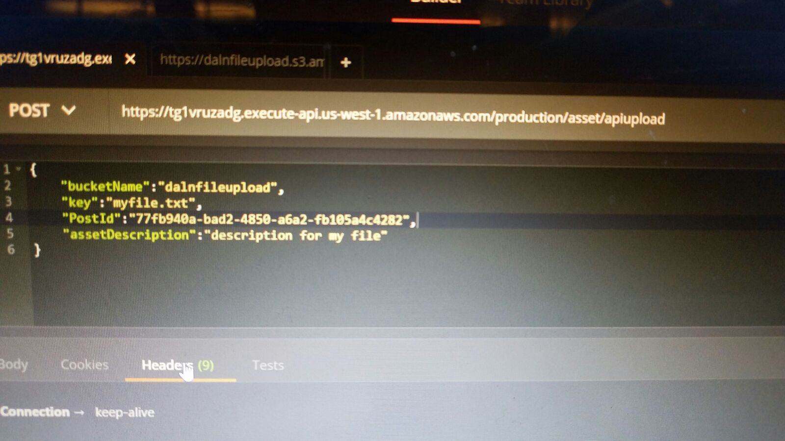

# Function:
- Fix submit form
    - get all data and post to summary
    - submit process:
        - ~~upload files locally? alt: just post at the end.~~ Upload at media step and just link the post in the end.
        - POST the post and return postID
        - call the https://tg1vruzadg.execute-api.us-west-1.amazonaws.com/production/files/upload/ + name of file, get the link, upload file to s3; ask for the name that is wanted for the file and a description, store in array.
        - call https://tg1vruzadg.execute-api.us-west-1.amazonaws.com/production/asset/apiupload to link the files to the post. For each file uploaded
         use the array from the previous step to get the description and name of the file.

# Design:
- Submit Form:
    - Only date picker.
    - General form design
    - Annnndddd back and next buttons
- Do all tasks asked for in emails.
- Circle logo with ctrl-m toggle
- List view:
    - functional list view using bootstrap 4 (Note: span-item block doesn't exist anymore, http://bootsnipp.com/snippets/VXAxV)
    - exise span-item-3 elements font and integrate into new class.
    - add pagination either ng bootstrap or http://jasonwatmore.com/post/2016/08/23/angular-2-pagination-example-with-logic-like-google
    - add search controls
    - fullscreen list-view search
    - pagination control
